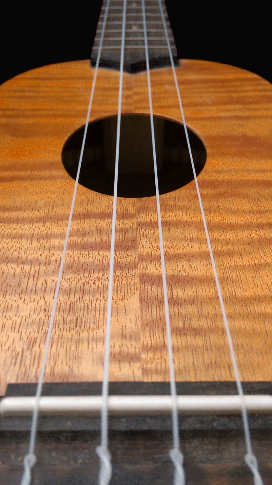

# Enigmar 🎮

Enigmar is a game about solving riddles. For each riddles there is no text explaining what you must do. The goal is to guess what must be done and then doing it. There are 32 levels and to you must solve all of them to finish the game !

If you are lost playing a level there are 3 clues that you can unlock if needed.

# Link 🔗

The game is available [here](https://play.google.com/store/apps/details?id=com.Luka.Panda&hl=fr&gl=US&pli=1) on Google Play

# Some riddles

For example in the riddle below you need to exchange to place of every red dots to the blue ones. to do that you have to arrow. One arrow that you move the red do if it can to the right. And one arrow that will move the red dot if it can to the left. Like in the checker game you can only jump a single dot if there is space after it.

One of the riddle is a photo of a ukulele on which you need to play replay a simple song by touching the cords. This riddle uses a photo of my Ukulele

